# Astra 🌌

> A private, 1-to-1 communication and trusted-location app built with Flutter.

Astra is a small personal communication app designed for private use between trusted people.  
The initial idea is simple: **chat, call, video call, and know where your trusted people are when location sharing is enabled.**

This project is **not intended as a production-scale messaging platform**. It is primarily a personal engineering project focused on real-time communication, WebRTC, background location, push notifications, and cross-platform mobile development.

---

## 📱 Screenshots

<p align="center">
  
</p>

### 🔐 Authentication & Onboarding
<p align="center">
  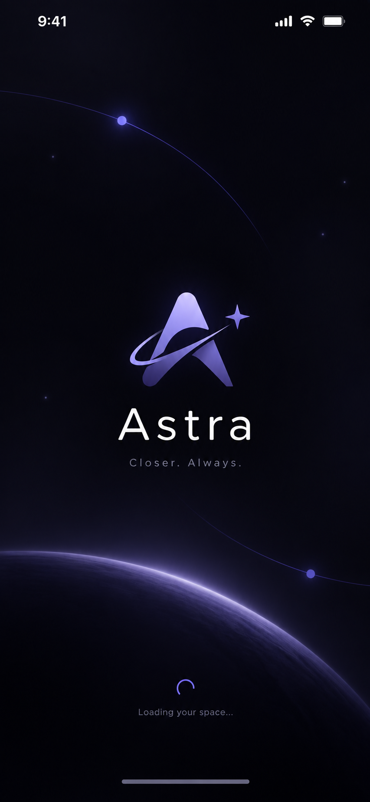
  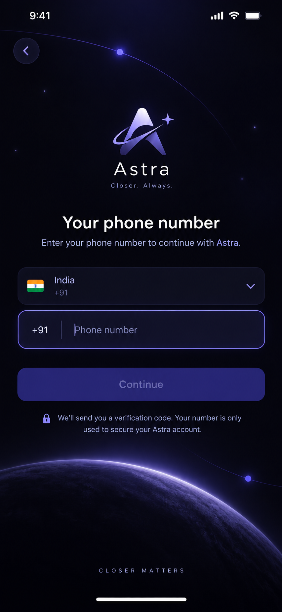
  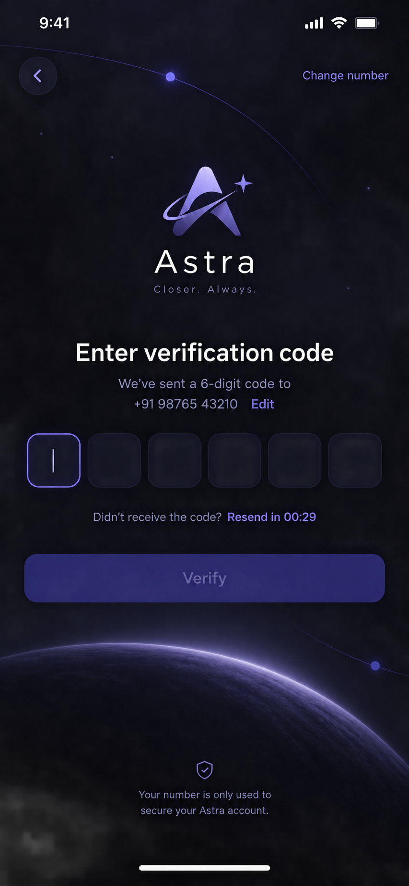
  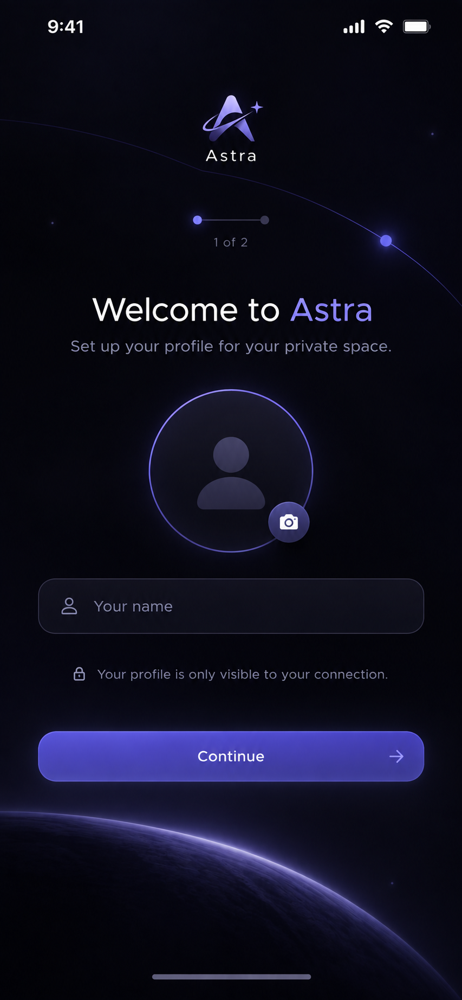
  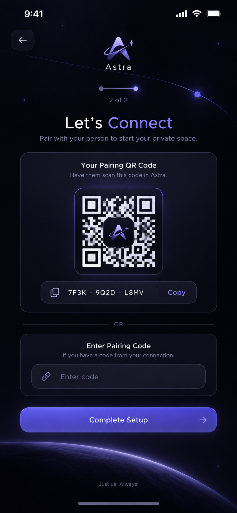
</p>

### 📍 Home & Live Location
<p align="center">
  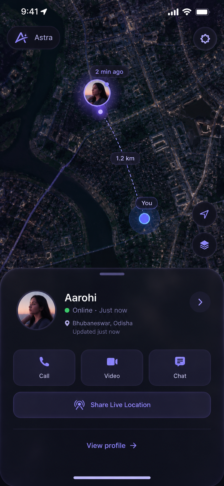
  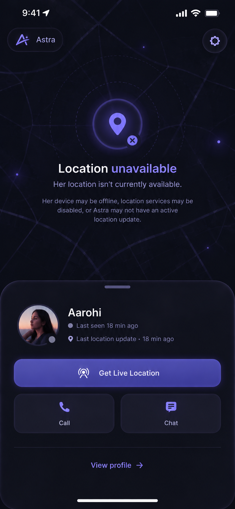
  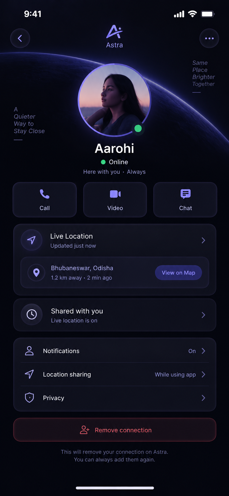
</p>

### 💬 Chat & Audio Messaging
<p align="center">
  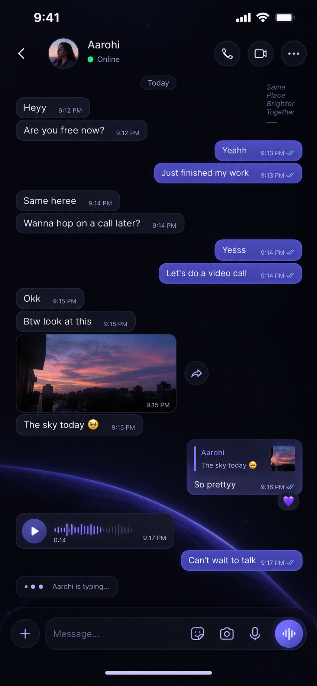
  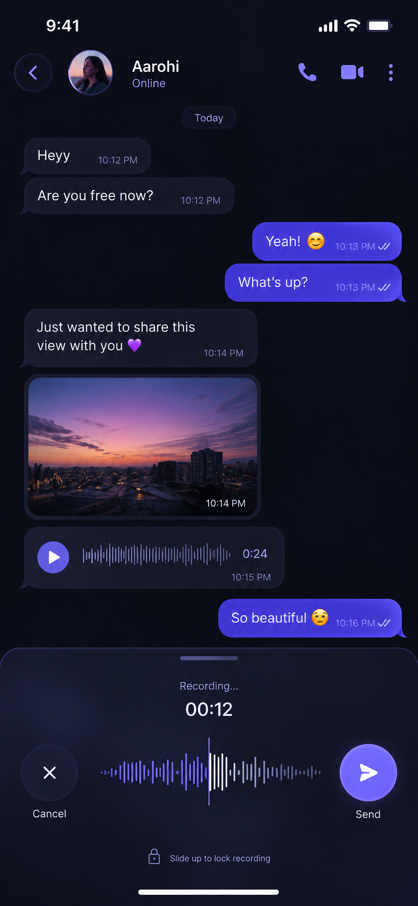
</p>

### 📞 Audio & Video Calls
<p align="center">
  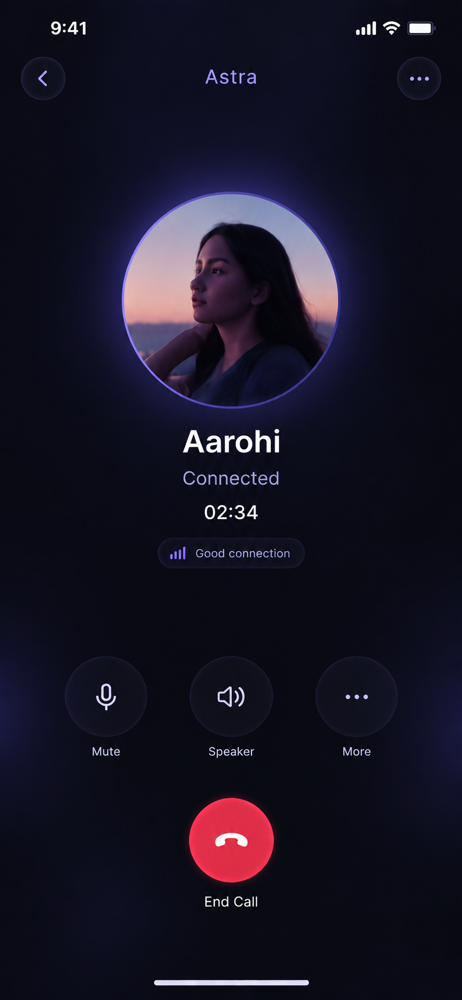
  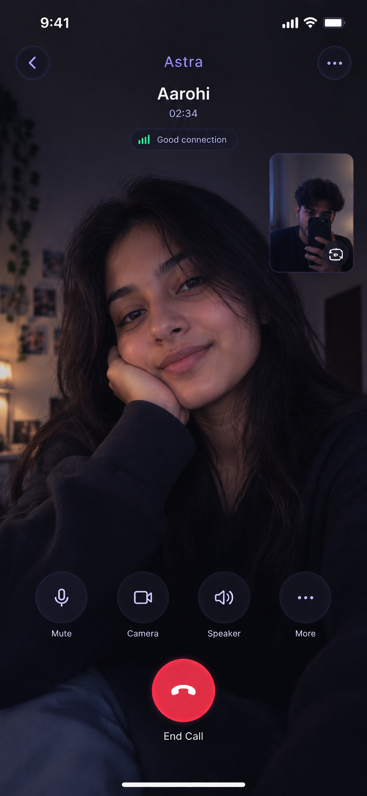
</p>

### 📲 Incoming Call & History
<p align="center">
  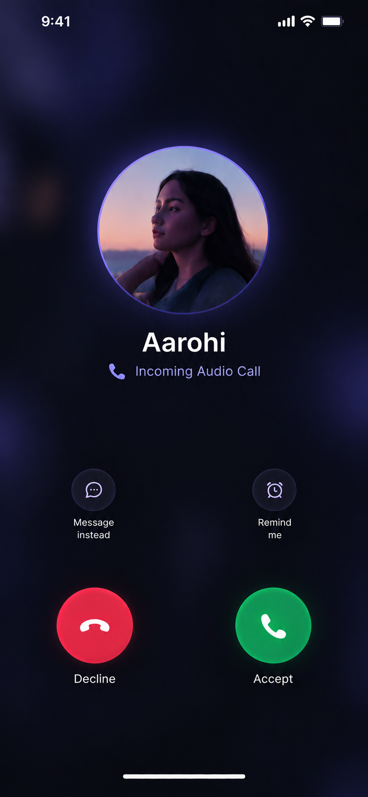
  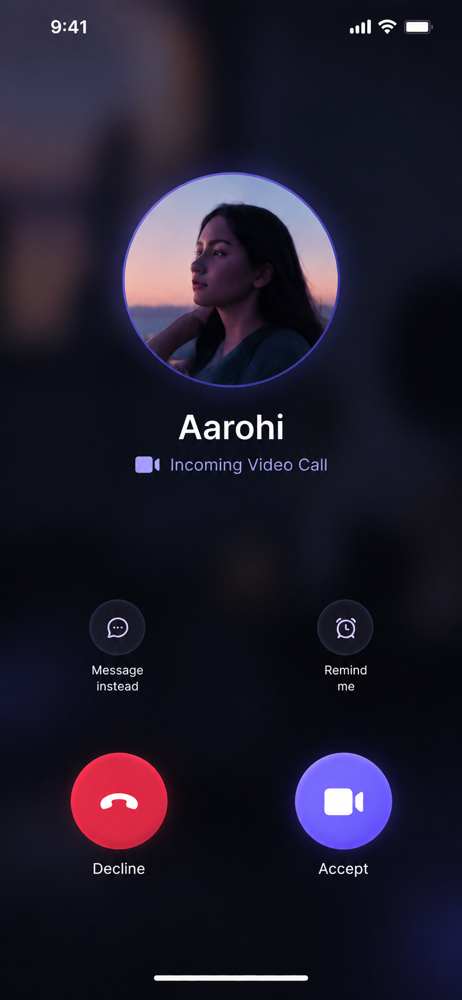
  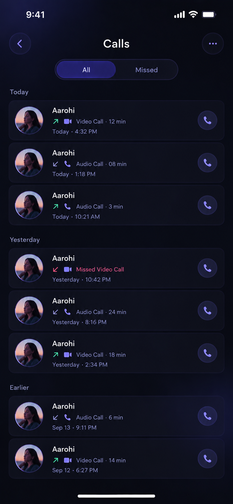
</p>

### ⚙️ Settings & Location Flow
<p align="center">
  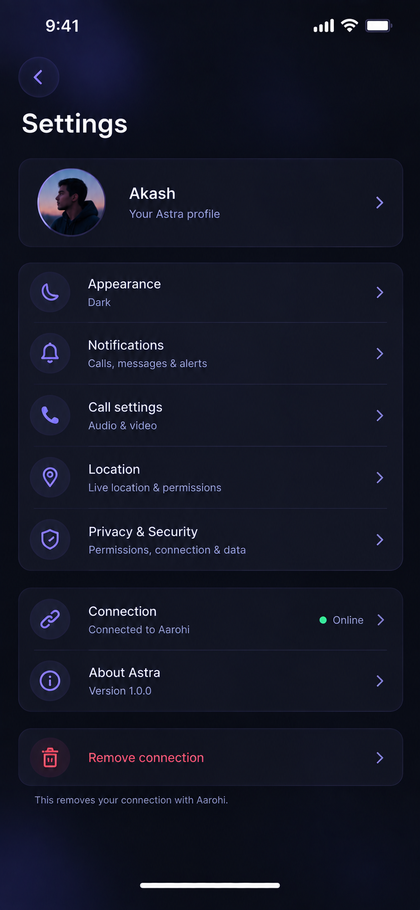
  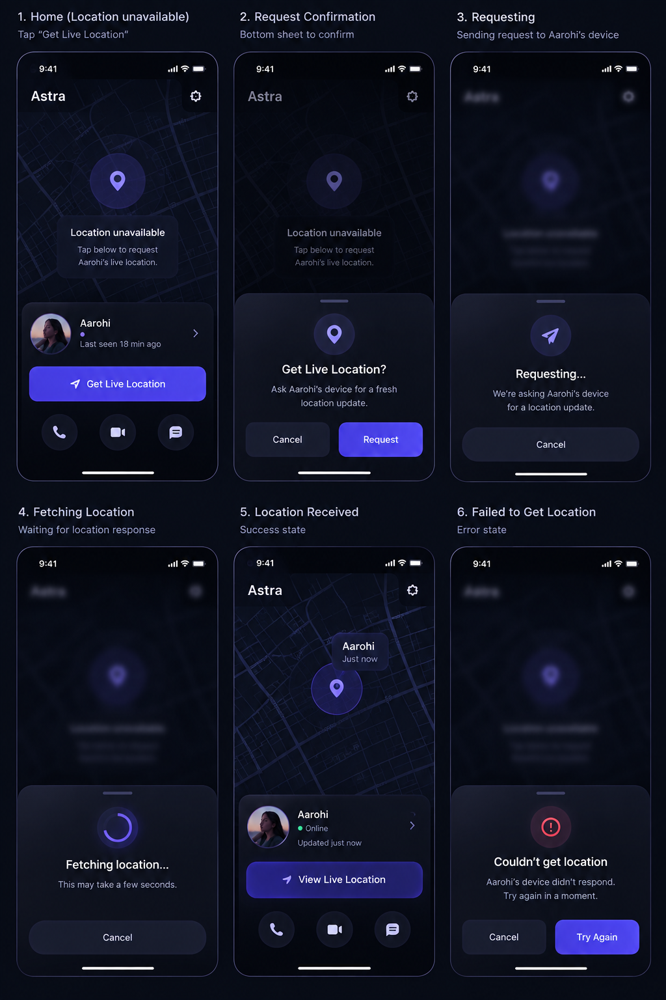
</p>

---

## ✨ Features

### 💬 Messaging
- 1-to-1 real-time chat
- Message replies
- Message reactions
- Stickers
- Typing indicator
- Voice messages
- Image sharing
- File sharing

### 📞 Calling
- 1-to-1 audio calls
- 1-to-1 video calls
- Screen sharing
- Picture-in-Picture (PiP)
- Incoming call UI
- Call history
- Call duration and call state handling

### 📍 Trusted Location
- Live location sharing
- Location available / unavailable states
- Request a fresh location update
- Background location support
- Trusted people
- Per-person location permissions

Astra separates **communication permissions** from **location permissions**.

For example:
```text
Aarohi
├── Chat       ✓
├── Audio      ✓
├── Video      ✓
└── Location   ✓

Mom
├── Chat       ✗
├── Audio      ✗
├── Video      ✗
└── Location   ✓
```

### 🟢 Presence
- Online / offline status
- Last seen
- Connection state

### 🎨 UI
- Dark mode
- Light mode
- Minimal iOS-inspired interface
- Deep indigo / violet Astra accent
- Responsive Flutter UI

---

## 🧭 Product Concept

Astra is designed around two separate concepts:

```text
                    Astra
                      │
          ┌───────────┴───────────┐
          │                       │
   Communication             Trusted Circle
          │                       │
     ┌────┼────┐             ┌────┼────┐
     │    │    │             │    │    │
    Chat Audio Video        Mom Sister Friend
     │    │    │             │
     └────┴────┘          Location
```

A person does **not** automatically receive access to every Astra feature.  
Permissions are relationship-based.

---

## 🔐 Pairing

Users can add another person using a short pairing code.

The intended flow:
```text
Generate Invite
      ↓
Temporary pairing code
      ↓
Other user enters code
      ↓
Connection request
      ↓
User accepts
      ↓
Relationship created
      ↓
Permissions applied
```

Pairing codes should be:
- Short-lived
- Single-use
- Rate limited
- Server validated
- Invalid after successful pairing

A pairing code alone should not automatically grant access to private data.

---

## 🏗️ High-Level Architecture

The project is designed around real-time peer communication with a lightweight backend.

```text
┌───────────────┐                 ┌───────────────┐
│  iOS Device   │                 │ Android Device│
│               │                 │               │
│ Flutter       │                 │ Flutter       │
│ WebRTC        │◄──── P2P ─────►│ WebRTC        │
│ Location      │                 │ Location      │
└───────┬───────┘                 └───────┬───────┘
        │                                  │
        │          Signaling               │
        └──────────────┬───────────────────┘
                       │
                ┌──────▼──────┐
                │   Backend   │
                │             │
                │ Signaling   │
                │ Presence    │
                │ Auth        │
                │ Location    │
                └─────────────┘
```

### Calling

The preferred architecture is:
```text
Camera / Mic
     ↓
WebRTC
     ↓
P2P connection
     ↓
Remote device
```

- STUN is used for NAT discovery.
- TURN is used as a fallback when direct connectivity is not possible.
- For video, the implementation can use a hardware-supported codec where available, with fallback negotiation handled through WebRTC.

---

## 📍 Location Architecture

Location sharing should not mean uploading GPS coordinates every second.

A better approach is:
```text
Location Provider
       ↓
Local sampler
       ↓
Distance / time threshold
       ↓
Should update?
   ┌───┴───┐
   No      Yes
   │        │
Discard   Send
            ↓
       Authorization
            ↓
       Location Store
            ↓
     Authorized People
```

The Home screen renders the latest authorized location.  
When location is unavailable, Astra should clearly show that state instead of displaying stale or fake data.

---

## 🔒 Privacy Model

Location is sensitive data, so access should be relationship-based.

Conceptually:
```text
Relationship
├── owner
├── viewer
├── status
├── location: true/false
├── chat: true/false
├── audioCall: true/false
└── videoCall: true/false
```

Backend authorization should verify the relationship and permission before returning private location data.

---

## 🛠️ Tech Stack

| Layer | Technology |
| --- | --- |
| Mobile | Flutter / Dart |
| Realtime Communication | WebRTC |
| Audio / Video | WebRTC |
| NAT Traversal | STUN / TURN |
| Signaling | TBD |
| Authentication | TBD |
| Backend | TBD |
| Database | TBD |
| Push Notifications | FCM / APNs |
| Background Location | Native platform services + Flutter integration |

> The exact backend stack may evolve as the project is implemented.

---

## 📂 Planned Project Structure

```text
lib/
├── core/
│   ├── config/
│   ├── networking/
│   ├── permissions/
│   └── utils/
│
├── features/
│   ├── auth/
│   ├── pairing/
│   ├── home/
│   ├── chat/
│   ├── calling/
│   ├── location/
│   ├── presence/
│   └── settings/
│
├── services/
│   ├── webrtc/
│   ├── signaling/
│   ├── location/
│   ├── notifications/
│   └── background/
│
└── main.dart
```

The final structure may change during implementation.

---

## 🚧 Project Status

**Early development / personal project**

Current focus:
- [x] Product concept
- [x] UI/UX direction
- [x] Home location dashboard concept
- [x] Chat interaction design
- [x] Calling UI concept
- [x] Call history design
- [x] Settings design
- [ ] Flutter implementation
- [ ] Authentication
- [ ] Pairing system
- [ ] Signaling server
- [ ] WebRTC audio calling
- [ ] WebRTC video calling
- [ ] Screen sharing
- [ ] Push / incoming calls
- [ ] Background location
- [ ] Trusted people
- [ ] Production hardening

---

## ⚠️ Disclaimer

Astra is currently a **personal / experimental project**.  
It is not designed to replace established emergency-location or safety services.

Location availability depends on:
- OS background execution policies
- Location permissions
- GPS/network availability
- Battery restrictions
- Device connectivity
- Application state

The app should never imply that a user's location is guaranteed to be available at all times.

---

## 🎯 Goals

The main goal of Astra is not to build another WhatsApp clone.  
The project is primarily an engineering exercise around:
- WebRTC
- P2P networking
- NAT traversal
- Real-time signaling
- Presence systems
- Background services
- Mobile permissions
- Location synchronization
- Push notifications
- Cross-platform Flutter architecture
- Secure relationship-based authorization

---

## 📌 Roadmap

```text
Phase 1: UI / Design System
      ↓
Phase 2: Authentication + Pairing
      ↓
Phase 3: 1-to-1 Chat
      ↓
Phase 4: WebRTC Audio
      ↓
Phase 5: WebRTC Video
      ↓
Phase 6: Screen Share + PiP
      ↓
Phase 7: Presence + Push
      ↓
Phase 8: Trusted People + Location
      ↓
Phase 9: Security + Reliability
      ↓
Phase 10: Testing / Optimization
```

---

## 👨‍💻 Author

**Akash**  
Built as a personal engineering project with Flutter, WebRTC and real-time networking.

---

## 📄 License

License information will be added when the project is finalized.
